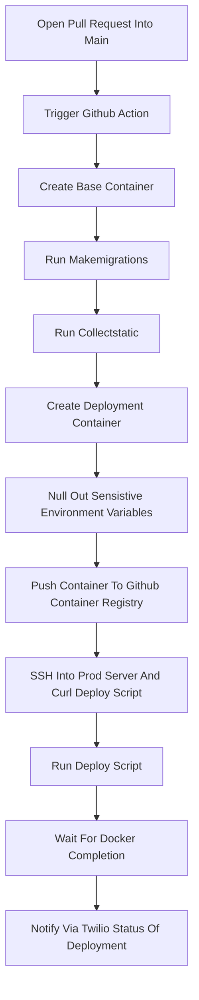

# Continuous Integration Strategy

To simplify the deployment process, I want to try and consolidate as much of the building and configuration into a series of github actions. That way I can define a simple startup bash script to run at start, and then package the system in a docker container. I'll simply need an action to ssh into my host, pull the container, and restart with the fresh image. 

The sequence is as shown below:

