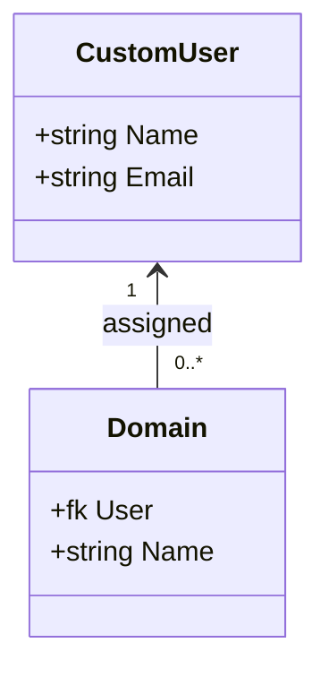

# Accounts

Accounts houses all of the internal user creation logic. This include responsibilities such as user creation, authentication, and identification. For that reason, the `Domain` object sits alongside the `CustomUser` object, as it's used to determine what data to show visitors. The `CustomUser` object is effectively just the standard Django User object, with the biggest difference being that we use the `email` field as a username instead of requiring users to provide a bespoke username.

## Data Model

