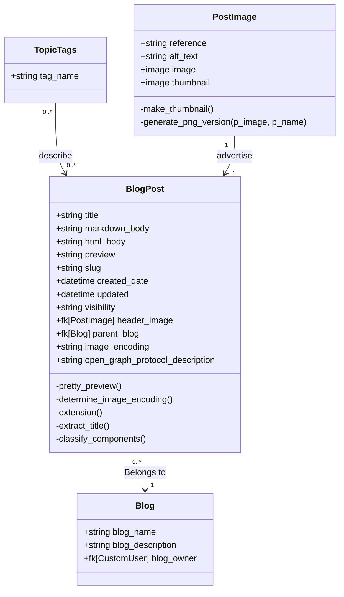

# Blog

The Blogging backend will power first and foremost, the blogging portion of the site. It supports header images and opengraph protocol metadata. In the future, the intention is for the BlogPost class to parent other, more specific forms of textual data.

## Data Model

