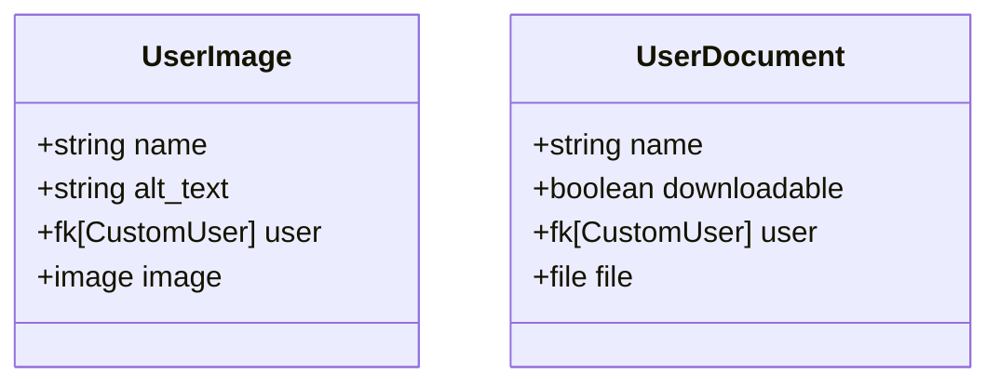

# Content

Content contains all of the models for user uploaded content which doesn't directly apply to another model. For example, the profile image stored under `landing_page.Avatar` would be managed by `landing_page`. For things such as images to be stored on blog posts, or documents attached to experience, they'd be created under content.

## Data Model

