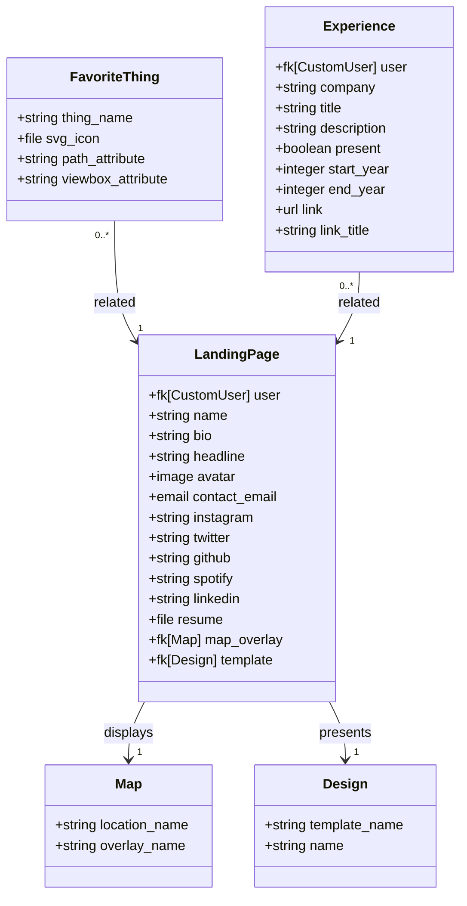

# Landing Page

The landing page is the heart of a user's profile. If implemented properly, the goal of the landing page + domain combo is to present as if this is the user's personal website. Obviously it is, but more specifically it should feel as if this site isn't living within a shared hosting space.

## Data Model

